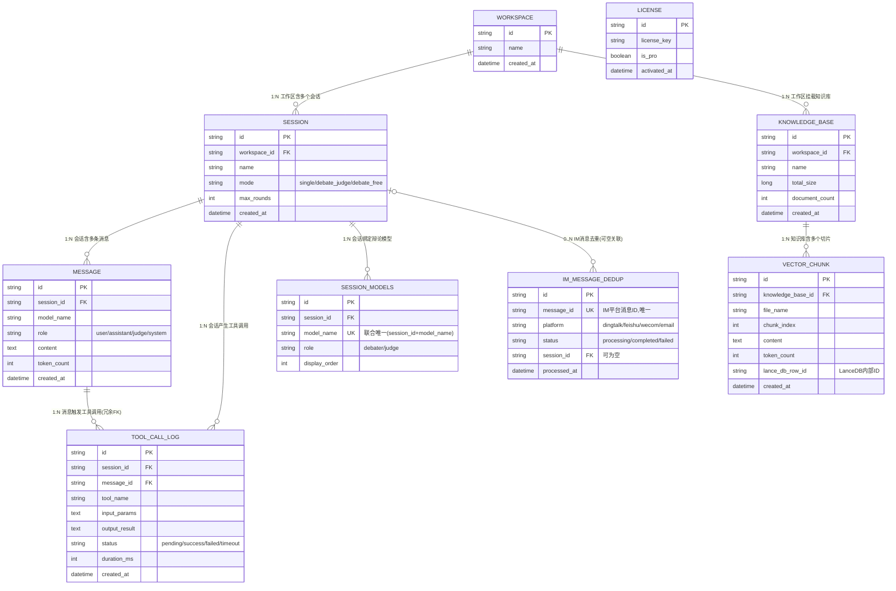

# OmniForge Core 架构设计文档（v5.1）

- 状态：✅ 已通过评审确认（2026-08-25，8 项决议）
- 本文档反映 v5.1 评审基线的架构与依赖关系；此后新增特性（QQ 官方机器人/NapCat、数据保留与备份、工具执行确认、MCP server、插件市场等）见 README 功能全景与 docs/ 下对应设计文档
- 本文档在每次架构变更后同步更新

---

## 1. Maven 多模块结构

```
omniforge/                                  # 仓库根（groupId: com.omniforge）
├── pom.xml                                 # 父POM：dependencyManagement + pluginManagement，统一版本
├── omniforge-common/                       # 公共基础库（无业务依赖）
│   └── com.omniforge.common                #   Tool SPI 契约、事件总线、异常体系、
│                                           #   JCE 加密工具、敏感信息掩码、日志追踪（MDC）
├── omniforge-core/                         # 核心引擎
│   └── com.omniforge.core
│       ├── gateway/      # 模型网关：Spring AI Alibaba 统一适配 + models.yml 热重载 + 超时熔断 + 成本计量
│       ├── agent/        # Agent引擎：ReActLoop、Sequential/Parallel/Routing/Loop 编排（Phase 1 后续）
│       ├── debate/       # 辩论引擎：有裁判/无裁判状态机 + 多重熔断（Phase 2）
│       ├── scheduler/    # 虚拟线程 + BlockingQueue 异步任务队列（统一 ThreadFactory）
│       └── persistence/  # JPA 实体 + Repository + SQLite(WAL) 事务管理（Phase 1 后续）
├── omniforge-tools/                       # 工具生态（Phase 1 后续）
│   └── com.omniforge.tools                #   MCP Client、OFT 规范转换、插件热加载、内置工具
├── omniforge-knowledge/                   # 向量知识库 RAG（Phase 1 后续）
│   └── com.omniforge.knowledge            #   SQLite 向量库 + DJL(ONNX) Embedding + 文档解析 + 语义分块
├── omniforge-gateway/                     # IM 消息网关（Phase 3）
│   └── com.omniforge.gateway              #   钉钉/飞书/邮件(Jakarta Mail)/企微 适配器 + 幂等去重
├── omniforge-ui/                          # JavaFX 展示层（Phase 1 后续）
│   └── com.omniforge.ui                   #   对话视图/知识库管理/暗黑模式/系统托盘
└── omniforge-app/                         # 可执行装配模块（Phase 1 收尾）
    └── com.omniforge.app                  #   GUI/Headless 双入口、Spring 上下文装配、jpackage
```

## 2. 模块依赖关系

```
                    ┌──────────────────────┐
                    │   omniforge-common   │  ← 所有模块的地基（SPI契约/事件/异常/加密/日志）
                    └──────────┬───────────┘
        ┌──────────────────────┼──────────────────────────┐
        ▼                      ▼                          ▼
┌───────────────┐      ┌───────────────┐        ┌──────────────────┐
│ omniforge-core│◄─────┤omniforge-tools│        │omniforge-knowledge│
│ 引擎/辩论/调度  │ 实现  │ (Tool SPI实现) │        │  (Tool SPI实现)   │
└───────┬───────┘ 注入  └───────┬───────┘        └────────┬─────────┘
        │                      │                         │
        │      ┌───────────────┴─────────────────────────┘
        │      ▼
        │  ┌────────────────┐        ┌──────────────┐
        ├─►│omniforge-gateway│───────►│  omniforge-ui │  JavaFX 组装全部能力
        │  └────────────────┘        └──────┬───────┘
        │                                   ▼
        │                        ┌──────────────────────┐
        └───────────────────────►│    omniforge-app     │  GUI/Headless入口 + jpackage
                                 └──────────┬───────────┘
                                            │ 私有仓库（Maven 私服 / profile，v5.1 决议 #2）
                                            ▼
                        ┌─────────────────────┐   ┌───────────────────────────┐
                        │   omniforge-pro     │   │ omniforge-enterprise-server│
                        │ (智能路由/License增强) │   │ (Spring Boot Web + PG + JWT)│
                        └─────────────────────┘   └───────────────────────────┘
```

| 模块 | 依赖模块 | 说明 |
|------|----------|------|
| omniforge-common | 无内部依赖 | SPI 契约、事件、异常、加密、日志 |
| omniforge-core | common | 核心不依赖 tools/knowledge（避免循环依赖） |
| omniforge-tools | common, core | 实现 Tool SPI，装配时注册进引擎 |
| omniforge-knowledge | common, core | knowledge_search 以 Tool SPI 接入 |
| omniforge-gateway | common, core | IM 消息 → 触发 Agent 会话 |
| omniforge-ui | common, core, tools, knowledge, gateway | 组装全部能力 |
| omniforge-app | 以上全部 | 唯一可执行模块，GUI/Headless 入口 |
| omniforge-pro（闭源） | core, tools, gateway | 私服引入，不开源 |
| omniforge-enterprise-server（闭源） | common, core | Spring Boot Web + PostgreSQL |

**关键架构决策（v5.1 已确认）**：
1. 仅 enterprise-server 使用完整 Spring Boot（Web）；core 以 autoconfiguration 方式被复用；ui/app 使用纯 Spring 容器 + JavaFX 原生启动（避免 fat-jar 与 jpackage 冲突）。
2. 闭源模块物理隔离于开源仓库之外，经 Maven 私服或 profile 引入。
3. JavaFX 采用 21 LTS（与 JDK 21 匹配）。

## 3. 数据库 ER 图（Mermaid）

### 3.1 单机版（SQLite，WAL 模式）— 9 张表



### 3.2 企业版（PostgreSQL，C/S 服务端）

企业版服务端为闭源商业版（不在本仓库），其 PostgreSQL Schema 设计随商业版发布，此处不展开。社区版单机模式 `--mode=standalone` 使用上文 SQLite Schema 即可完整运行。

**设计说明**：
- 两套 Schema **彻底分离、互不兼容、部署二选一**（v5.1 决议 #7）；`--mode=standalone` 连接 SQLite，`--mode=enterprise` 连接 PostgreSQL + 企业版服务端 API。
- `TOOL_CALL_LOG.message_id` 为冗余外键（`session_id` 已可追溯），保留用于按消息直查。
- 向量本体存 SQLite 向量表 `vectors.db`（384 维小端序 BLOB，WAL），随主库独立文件存放。
- `IM_MESSAGE_DEDUP.message_id` 唯一索引支撑永久去重：processing 防重入、completed 永久拒绝。
- `SESSION_MODELS` 联合唯一 (session_id, model_name)：debater 参与自由辩论；debater + judge 构成裁判模式。
- 建议索引：`(session_id, created_at)`、`knowledge_base_id`、`message_id`。

## 4. 开源组件依赖清单（含协议类型）

> 风险标记：✅ 安全可商用闭源 ｜ ⚠️ 需注意/有前提 ｜ ❌ 禁止（GPL/AGPL 强传染）

| 组件 | 协议 | 风险 | 说明 |
|------|------|------|------|
| JDK 21（Adoptium/Temurin） | GPL-2.0 **+ Classpath Exception** | ✅ | CE 条款允许随闭源产品分发 |
| Spring Boot / Framework / Spring AI / Spring AI Alibaba | Apache 2.0 | ✅ | 整链 Apache 2.0 |
| dashscope-sdk-java（阿里云） | Apache 2.0 | ✅ | |
| Spring Data JPA | Apache 2.0 | ✅ | |
| **Hibernate ORM** | **LGPL-2.1** | ⚠️ | 弱传染；动态链接无需开源，符合规则 |
| sqlite-jdbc（org.xerial） | Apache 2.0 | ✅ | 内含 SQLite 原生库（public domain） |
| PostgreSQL JDBC（企业版） | BSD-2-Clause | ✅ | |
| HikariCP | Apache 2.0 | ✅ | |
| SLF4J | MIT | ✅ | |
| Log4j2 | Apache 2.0 | ✅ | |
| Jackson | Apache 2.0 | ✅ | |
| JUnit 5 | EPL-2.0 | ✅ | 仅测试 |
| Mockito | MIT | ✅ | 仅测试 |
| LanceDB（com.lancedb:lancedb） | Apache 2.0 | ✅ | 早期版本 API 可能变动，封装隔离 |
| DJL（ai.djl） | Apache 2.0 | ✅ | |
| ONNX Runtime | MIT | ✅ | 如换 PyTorch 引擎则 BSD-3-Clause，同样 ✅ |
| all-MiniLM-L6-v2 模型权重 | Apache 2.0 | ✅ | 模型权重许可单独声明；首启按需下载（决议 #8） |
| Apache PDFBox / POI | Apache 2.0 | ✅ | |
| JEP（Java Embedded Python） | zlib | ✅ | 宽松许可 |
| JNA | Apache 2.0 / LGPL-2.1 双许可 | ✅ | |
| OkHttp | Apache 2.0 | ✅ | |
| Jakarta Mail（Angus Mail） | EPL-2.0 + GPL-2.0+CE 双许可 | ✅ | 邮件 IMAP/SMTP（决议 #4） |
| 钉钉 SDK | Apache 2.0 | ✅ | |
| 飞书 SDK | MIT | ✅ | |
| 企业微信 SDK（WxJava） | Apache 2.0 | ✅ | 实施时以仓库 LICENSE 复核 |
| NapCatQQ | 外部进程（OneBot 11） | ✅ | HTTP/WebSocket 通信，无代码链接 |
| Tavily API | 外部 HTTP 服务 | ✅ | 无客户端依赖 |
| **SearXNG** | **本体 AGPL-3.0** | ⚠️ | 仅 HTTP API 调用、不修改不分发 → 无传染 |
| **OpenJFX（JavaFX 21 LTS）** | **GPL-2.0 + Classpath Exception** | ⚠️ 需说明 | "JDK 式"许可，CE 允许闭源链接与分发；须保留许可声明 |
| ControlsFX | BSD-3-Clause | ✅ | |
| flexmark-java / commonmark-java | BSD-2-Clause | ✅ | 替代停更的 markdown4j |
| jjwt / Spring Security / Bouncy Castle | Apache 2.0 / Apache 2.0 / MIT | ✅ | 企业版 |

**合规结论**：✅ 未发现 GPL/AGPL 强传染依赖。OpenJFX（GPL+CE）与 Hibernate（LGPL-2.1）为两处特殊说明项，均可闭源商用分发；分发时通过 `jpackage --license-file` 随包附带第三方许可文本。

## 5. 开源仓库树（v5.1 决议 #2/#3）

```
OmniForge/                                    # 开源仓库（Apache 2.0）
├── LICENSE
├── README.md
├── pom.xml                                   # 父POM
├── omniforge-common/                         # v5.1 新增
├── omniforge-core/
├── omniforge-tools/
├── omniforge-gateway/
├── omniforge-ui/
├── omniforge-knowledge/
├── omniforge-app/                            # v5.1 新增
├── docs/                                     # ARCHITECTURE.md 等
├── builds/                                   # 打包产物（.gitignore）
└── scripts/
闭源模块 omniforge-pro / omniforge-enterprise-server：私有仓库 + Maven 私服/profile 引入。
```

## 6. v5.1 评审决议摘要（2026-08-25）

1. **7 张核心表**（"5张表"为笔误），新增两表后单机版共 9 张。
2. **闭源模块不进开源仓库**，走私服/profile。
3. **新增 omniforge-common 与 omniforge-app**。
4. **MailKit → Jakarta Mail**（.NET 笔误）。
5. **IM_MESSAGE_DEDUP**：messageId 唯一索引，processing 防重入 / completed 永久去重。
6. **SESSION_MODELS**：debater/judge 角色 + 显示顺序。
7. **企业版 Schema 彻底分离**：SQLite 9 表 vs PostgreSQL 4 表，`--mode=standalone|enterprise` 切换。
8. **Embedding 首启按需下载**：HuggingFace → `~/.omniforge/models/`，进度条/重试/跳过，支持 Ollama 等远程替代。

## 6.1 Phase 2 辩论引擎方案（v5.2 冻结，2026-08-26，不再修改）

```
DebateEngine（自研：轮次状态机 / 四重熔断 / 语义共识 / 单调性检测 / 裁判裁决 / 辩论记录）
    │ 每轮（动态构建）
    ▼
ParallelAgent（SAA：subAgents 运行时按用户所选模型构建）
    ├─ ReactAgent#1 ── Builder.model(modelGateway.chatModel(alias1))
    ├─ ReactAgent#2 ── Builder.model(modelGateway.chatModel(alias2))
    └─ ...（stream() → Flux<NodeOutput> 并发流式渲染）
```

- 动态子 Agent 列表：✅ 源码实证（`ParallelAgent.builder().subAgents(List<Agent>)`、`Builder.model(ChatModel)` 每模型绑定）
- 硬约束：**2 ≤ 子 Agent ≤ 10**（validate 强制）、子 Agent 须为 BaseAgent（ReactAgent）、outputKey 唯一
- 数量上限已写入需求 v5.2：单场辩论最多 10 个模型（CE 上限 3）
- 有裁判模式：裁判模型经 `LlmRoutingAgent.model(ChatModel)` 注入或直接经网关注入裁决
- 注意：`Agent.invoke/stream` 抛受检 `GraphRunnerException`；ParallelAgent 为单轮 fan-out/gather，多轮由 DebateEngine 驱动
- 依赖：`com.alibaba.cloud.ai:spring-ai-alibaba-agent-framework`（版本由 spring-ai-alibaba-bom 管理，Phase 2 引入）
- 备选：`LoopAgent` 的 `LoopStrategy.loopDispatch(OverAllState)` 可挂自定义共识判定

## 7. 运行模式与 Embedding 方案

- GUI 模式：桌面双击启动 JavaFX 窗口；Headless 模式：`omniforge --headless`，监听 `http://localhost:5119/health`。
- Embedding 下载流程：首启检测 `~/.omniforge/models/` → 缺失则从 HuggingFace 下载 all-MiniLM-L6-v2 → UI 进度条 → 失败可重试或跳过（默认 CPU Embedding）→ 支持配置远程服务（Ollama 等）绕过下载。

## 8. 版本锁定基线（2026-08）

| 组件 | 版本 | 备注 |
|------|------|------|
| JDK | 21 LTS（Temurin） | 虚拟线程 |
| Spring Boot | 3.5.x（当前 3.5.4） | Spring Boot 4 尚未获 Spring AI Alibaba 官方适配 |
| Spring AI | 1.1.2 | 与 SAA 四段式版本号锁定 |
| Spring AI Alibaba | 1.1.2.x（当前 1.1.2.1） | starter-dashscope |
| JavaFX | 21 LTS | jpackage 打包 |

> 版本锁定依据（2026-08 检索）：Spring AI Alibaba 1.1.2.0 为 2026 年新项目推荐"黄金组合"稳定版（配 Spring Boot 3.5.x + Spring AI 1.1.2），官方文档展示 starter-dashscope 1.1.2.1；若 Maven Central 解析失败需启用阿里云镜像仓库（父 POM 已内置 aliyun-public 镜像）。
>
> ⚠️ 实战坑（2026-08-26 首次构建发现）：1.1.2.x 的 `spring-ai-alibaba-bom` **不再管理** `spring-ai-alibaba-starter-dashscope` 的版本（BOM 导入后该依赖报 version missing），omniforge-core POM 中已对 starter 显式锁定 `${spring-ai-alibaba.version}`。备选：1.1.2.2（Maven Central 最新）；另存在新 SDK starter 构件 `spring-ai-alibaba-starter-dashscope-sdk`（本项目暂用经典 starter）。
>
> ⚠️ SDK API 差异（编译实测，1.1.2.x / Spring AI 1.1.2）：
> 1. `OpenAiChatOptions` builder 的 `with*` 命名已移除，改为无前缀：`.model()` / `.temperature()` / `.maxTokens()`；
> 2. `DashScopeChatOptions.builder()` 返回 `DashScopeChatOptionsBuilder`，保留 `with*` 命名，且不可赋值给 `DashScopeChatOptions.Builder`（该嵌套类型已指向 `ToolCallingChatOptions.Builder`）——声明时用 `var`；
> 3. `AssistantMessage.getContent()` 已移除，改回 `getText()`；
> 4. `Usage.getGenerationTokens()` 不存在，实际方法为 `getCompletionTokens()`（`getPromptTokens()` 不变）；
> 5. `ToolCall` 是 `AssistantMessage` 的**嵌套 record**：`AssistantMessage.ToolCall(id, type, name, arguments)`；
> 6. **`ToolCallingChatModel` 接口在 1.1.2 已整体移除**，工具调用能力由 `ToolCallingChatOptions` 承载：`ToolCallingChatOptions.builder().toolCallbacks(ToolCallback[])` / `.internalToolExecutionEnabled(false)` 随 `Prompt` 传入（`call(Prompt)` 单参）；内部执行循环默认开启会吞掉中间步骤，自研 ReAct 循环必须显式关闭；
> 7. `ToolResponseMessage`/`AssistantMessage` 的构造器改为 protected，必须用 builder：`ToolResponseMessage.builder().responses(list).build()`、`AssistantMessage.builder().content(...).toolCalls(...).build()`；
> 8. `Usage` 接口含抽象方法 `getNativeUsage()`（自定义实现需覆盖），`getTotalTokens()` 已是 default 方法；
> 9. 1.1.2 的 `ToolCallingChatOptions.builder()` 等方法对 DashScope builder 有 deprecation 警告（非阻塞），后续 SDK 升级时留意。
