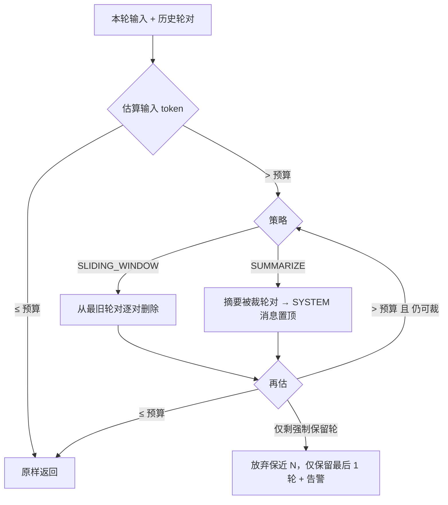

# ContextManager（上下文裁剪）设计文档

> 版本 v1.2（2026-08-28）｜状态：已交付（构建全绿，开源 176 用例）
> 设计依据：「上下文管理与状态持久化」需求（多轮上下文自动裁剪）。
>
> 交付记录：core.context 包 9 类（TokenEstimator/ContextTrimmer/DefaultContextManager/自动装配等）、
> 三路接线（UI 直连/UI Agent/IM）、配置中心「上下文」区段 + 清空上下文按钮、需求文档 v5.5。
> 构建踩坑修正：引擎循环原地追加助手消息导致测试断言竞态（改为调用时刻快照）、
> map() 产 null 触发 Optional NPE（模型未配置窗口时）、空白摘要未归一化。

## 1. 背景与目标

**现状（代码实证）**：三个对话路径每次调用仅携带当前单条输入，模型对历史一无所知——

| 路径 | 位置 | 历史回传 | sessionId |
|---|---|---|---|
| UI 直连对话 | `OmniForgeApplication.startDirectChat` | 无（`GatewayRequest` 仅 userText） | 无 |
| UI Agent 对话 | `OmniForgeApplication.startAgentChat` | 无（`AgentRunRequest` 仅 userText） | null |
| IM 消息 | `ImAgentMessageHandler.runAgent` | 无（每条消息独立） | null |

`ReactAgentLoop` 内部 messages = [system?] + [user]；轮内工具观察消息（ToolResponseMessage）为循环内部状态，不属会话历史。长对话中用户每次都要重复背景；反之若全量回传历史，token 成本线性增长并最终超出模型上下文窗口。

**目标**：

1. 以会话为单位累积对话历史（多轮上下文）——落实 §4.2「上下文管理与状态持久化」中"上下文管理"部分
2. 上下文逼近预算时自动裁剪，保证长对话可持续且不超窗口
3. 零新增依赖、零新增数据库表；所有配置 GUI 化（v5.3 决议）

**非目标（本期不做）**：

- 会话列表 / 多会话切换 UI（C 级企业版会话管理，维持推迟）
- 裁剪"遗忘"内容的可追溯界面（仅日志记录）

## 2. 范围界定

**本期交付**：

1. omniforge-core 新增 `com.omniforge.core.context` 包：ContextManager + 会话存储 + 裁剪器 + Token 估算
2. 三条调用路径接入（UI 直连 / UI Agent / IM）
3. 配置中心新增「上下文」区段 + 聊天工具栏「🧹 清空上下文」按钮
4. 需求文档升版记录 + 全量测试

**模块结构 / ER / 依赖清单**：无新模块（core 内新增包）、无新依赖（纯 JDK + 现有 Spring AI Message）、无新表（复用现有 Session/Message 实体，仅当待确认 #2 选择落库时启用）。

## 3. 核心设计

### 3.1 数据模型（core.context）

```java
/** 会话中的一条历史消息；一轮 = 用户输入 + 助手回复，成对原子裁剪 */
public record ContextEntry(ContextRole role, String content, int estimatedTokens) {}

public enum ContextRole { SYSTEM, USER, ASSISTANT }

/** 裁剪策略 */
public enum TrimStrategy {
    SLIDING_WINDOW,  // 从最旧轮对逐对删除
    SUMMARIZE        // 滑动窗口 + 被裁部分先摘要为一条 SYSTEM 消息
}

/** 上下文设置（context.yml 持久化 + 热生效 holder，模式同 tools.yml） */
public record ContextSettings(
    boolean enabled,              // 总开关，默认 true（false = 完全回退现状单条消息）
    int maxInputTokens,           // 输入 token 预算，默认 32_000（用户确认：16K 改 32K）
    int keepRecentTurns,          // 强制保留最近 N 轮，默认 5（用户确认：3 改 5；0 = 不强制）
    TrimStrategy strategy,        // 默认 SLIDING_WINDOW
    String summarizeModelAlias    // 摘要模型别名（null = 当前对话模型）
) {}
```

### 3.2 Token 估算（零依赖启发式）

- 中文/日韩文：≈ 1 token/字
- 拉丁字母/数字：≈ 4 字符/token
- 空白与标点：折半计入
- 空串记 0，非空内容不足 1 记 1
- **保守系数 ×1.15**（对分词器估算偏差的方向性补偿）

> 依据：英文 4 字符/token 为社区通用近似；中文在多数 BPE 分词器下 ≈0.6~1 token/字，取 1 为保守值。估算仅用于裁剪决策，成本计量仍用 usage 实际值，两者互不影响。

### 3.3 裁剪算法

输入：历史轮对列表、当前 user 输入、ContextSettings、模型窗口。
**预算** = min(maxInputTokens, 模型 contextWindowTokens × 0.8)；模型未配置窗口（§4）→ 仅按 maxInputTokens。

规则（优先级从高到低）：

1. 系统消息（若有）永远保留，其 token 计入预算
2. 当前 user 输入永远保留
3. 历史按轮对（user+assistant）从最旧开始删除，直到预算满足——**绝不拆开一对**（保持 user/assistant 交替，规避 DeepSeek 等 API 的交替校验）
4. 强制保留最近 keepRecentTurns 轮；若"保近 N 轮"与预算冲突（保留部分仍超预算）→ 例外放弃保近 N，仅保留最后 1 轮 + 日志告警
5. SUMMARIZE 策略：裁剪发生时，对被裁掉的轮对先调用摘要模型生成 ≤600 字摘要，作为 SYSTEM 消息置于历史最前（格式：【对话历史摘要】…）；摘要调用失败 → 自动降级为纯滑动窗口（日志告警，不中断对话）



### 3.4 ContextManager API

```java
public interface ContextManager {
    /** 追加一条会话历史（user/assistant 成对出现；assistant 于回复完成后追加） */
    void append(String sessionId, ContextRole role, String content);

    /** 构造发送给模型的完整消息列表：system? → 裁剪后历史 → 当前输入 */
    List<Message> buildMessages(String sessionId, String systemText, String userText);

    /** 清空会话上下文（「清空上下文」按钮） */
    void clear(String sessionId);

    /** 当前会话的轮数与估算 token（状态栏可选展示） */
    ContextStats stats(String sessionId);
}
```

**存储**：`ConcurrentHashMap<String, SessionContext>`（轮对列表 + 最近访问时间）。淘汰策略：会话容量上限（默认 256 个，防 IM 无界增长）+ 空闲 TTL（默认 24h）——访问时懒淘汰 + 每 30 分钟虚拟线程定时清扫。**不引入 Caffeine 等新依赖**。

### 3.5 请求记录扩展（接线用）

- `AgentRunRequest` 增 `List<Message> history` 字段（默认 List.of()；null 兼容）——**ContextManager 未装配/关闭时现有行为完全不变**
- `GatewayRequest` 增 `List<GatewayHistoryMessage> history`（新 record：role + text）——避免 gateway 层直接耦合 Spring AI Message 类型
- `ReactAgentLoop`：messages = [system?] + [history...] + [user]，其余循环逻辑不动
- `SpringAiChatModelProvider`：GatewayHistoryMessage → UserMessage/AssistantMessage 转换

## 4. 三条路径接入

| 路径 | sessionId | 追加时机 | 说明 |
|---|---|---|---|
| UI 直连 | `ui:default`（默认工作区） | 发送后追加 USER；stream complete 后追加 ASSISTANT | 工具栏「🧹 清空上下文」按钮 |
| UI Agent | 同上（**与直连共享会话**，模式切换上下文连续） | 同上（Agent Completed/Failed 后追加最终文本） | 历史经 AgentRunRequest.history |
| IM | `im:<platform>:<chatId>`（platformContext 提取） | 路由受理后追加 USER；回复回发后追加 ASSISTANT | 各平台各会话隔离，TTL 24h |

IM 注意：现有 handler 为同步阻塞 run()，追加历史不改变该行为；「辩论：」消息不进入上下文（辩论为独立编排，维持现状）。

## 5. 配置与 GUI

- `application.yml`：`omniforge.context.enabled / max-input-tokens / keep-recent-turns / strategy / summarize-model-alias`（默认值即 3.1）
- `models.yml`：每模型可选新增 `contextWindowTokens`（配置中心模型卡片新增「上下文窗口」输入框，留空 = 未知 → 仅按全局预算）
- 配置中心新增「上下文」区段（表单化，风格同现有工具开关区段）：总开关、策略下拉（滑动窗口 / 滑动窗口+摘要）、输入预算（千 token，带建议值提示）、保留最近轮数、「摘要模型」下拉（复用模型别名列表）
- 持久化：新增 `context.yml`（Jackson YAML + 热生效 holder，模式同 tools.yml）

## 6. 测试计划

**单元（core，预估新增 8 个测试类）**：

1. `TokenEstimatorTest`：中文/英文/混合/空串/边界
2. `SlidingWindowTrimmerTest`：未超预算不动；超预算删最旧；轮对原子性（不拆对）；keepRecent 生效；预算极端小 → 降级保留最后 1 轮且无异常
3. `SummarizeTrimmerTest`：摘要触发一次；摘要失败降级滑动窗口；摘要 SYSTEM 置顶
4. `ContextManagerTest`：append/buildMessages 顺序断言；clear；stats；TTL 淘汰（时间注入）；并发 append 安全
5. `ReactAgentLoopTest` 增：history 注入顺序（system → history → user）；history 为空 = 现状
6. Gateway/Provider 测试：GatewayHistoryMessage → Spring AI Message 转换

**集成**：UI 装配冒烟增 ContextManager Bean 断言；IM handler 会话隔离测试（两个 chatId 互不串扰）。

**真机验收**：长对话（超预算）模型仍正常回复且保留最近 3 轮；开启摘要后回复质量不劣化；「清空上下文」后模型不再引用旧内容。

## 7. 风险与对策

| 风险 | 对策 |
|---|---|
| 启发式 token 估算偏差 | 保守系数 1.15 + 模型窗口 ×0.8 余量；成本计量仍用 usage 实际值 |
| 摘要额外调用增加延迟与成本 | 默认关闭；失败自动降级滑动窗口；摘要调用记日志（后续可并入成本计量） |
| 上下文内存无界增长 | 会话容量上限 256 + TTL 24h 懒淘汰 + 定时清扫 |
| 直连/Agent 模式切换后行为变化（原无历史） | 总开关 enabled 可一键关闭回退现状；共享会话保证两模式上下文连续 |
| 各模型窗口大小不一 | models.yml 可选 contextWindowTokens，未配置走全局预算 |

## 8. 确认记录（2026-08-28，用户逐项确认）

1. ✅ 摘要策略纳入本期，默认关闭（策略下拉第二项）
2. ✅ 维持内存态（重启丢失由「清空上下文」按钮兜底；落库随企业版会话管理）
3. ✅ 默认预算 **32K** 输入 token + 保留最近 **5** 轮（16K/3 轮改为 32K/5 轮）
4. ✅ UI 直连与 Agent 共享同一会话上下文（sessionId 唯一键）
5. ✅ 需求文档升 v5.5 随编码一并更新
6. ✅ 补充：淘汰双路径——访问时懒淘汰 + ScheduledExecutorService 每 30 分钟定时清扫（TTL 24h + 容量 256 LRU），测试用注入 Clock 验证，防内存泄漏
