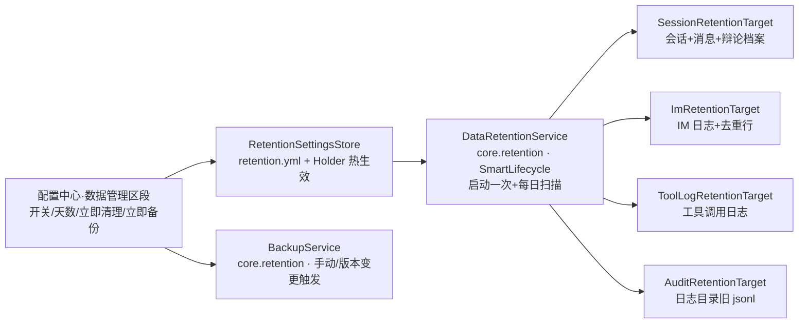

# 数据保留策略 + 升级自动备份设计（DATA_RETENTION_DESIGN）

> 状态：**已确认 · 已交付**（2026-09-11，Q1-Q4 全部采纳推荐项；实施提交 `c410415`，无偏差，见 §六）
> 最后更新：2026-09-11
> **基线：开源仓库 `9ff16f3` / 企业仓库 `ff7b6c8`**（设计依据的代码事实均按此基线逐行核实；实施前若基线前移，由设计窗口重新核对）
> 分工：本设计由设计窗口产出，确认后交开发窗口实施（设计窗口不编码）
> 归属：A 级缺口批次（A3 保留策略 + A4 升级备份）。
> 代码实证基线（2026-09-11）：单机 SQLite 实体时间戳齐备（Message.createdAt / Session.createdAt / DebateRecord.startedAt·finishedAt / ImMessage.receivedAt / ToolCallLog.createdAt；Session 无独立 updatedAt，最后活动=最新消息时间）；审计为每日 JSONL（audit-YYYY-MM-DD.jsonl，AuditLogService.java）；现有数据面操作仅「清空所有数据」一键全删；**无迁移前备份、无自动清理**。db 路径默认 `<配置目录>/omniforge.db`（PersistenceProperties：`omniforge.persistence.database-file`，`:memory:` 特殊值），向量库 `<配置目录>/vectors.db`。Schema 演进先例：启动 PRAGMA 检查缺列 → ALTER 迁移（SqliteVectorStore category 列）。

---

## 一、决策点（待编号确认）

- **Q1 清理分类与默认天数**：A=分三类各自可配——对话会话 90 天 / IM 与工具调用日志 90 天 / 审计 180 天（推荐）；B=单一天数全局统管。默认全部**关闭**（保留策略默认不启用），开启后安排每日后台扫描。
- **Q2 清理对象范围**：A=会话+消息+辩论档案+IM 日志（含去重行）+工具调用日志+审计旧日文件；**知识库/向量切片/授权状态/配置/密钥库一律不动**（推荐）；B=仅会话与审计两类。
- **Q3 触发方式**：A=启动时一次 + 每日后台扫描 + 数据模块「立即清理旧数据」手动按钮（清理前确认弹窗、显示本次将删除条目数）（推荐）；B=仅手动触发。
- **Q4 升级自动备份**：A=启动时比对 `schemaGeneration` 常量与落盘标记（`.schema-version` 文件），不一致且库文件存在 → 自动复制 omniforge.db + vectors.db（含 -wal/-shm 侧车，逐个 Files.copy）至 `<配置目录>/backups/`，命名含旧标记+时间戳，保留最近 3 份自动轮换；标记在 Spring 上下文成功启动后（ContextRefreshedEvent）才回写——失败启动下次仍会再备份；数据模块加「立即备份」按钮（推荐）；B=仅手动备份按钮。

---

## 二、现状与缺口（代码实证）

1. 需求源头：『90 天归档、180 天物理删除』『升级执行增量脚本并备份旧库』——A3/A4 立项依据。
2. **无任何定时清理组件**：core 现有唯一周期任务是 ContextManager 的 30 分钟清扫（SmartLifecycle 先例，可复用模式）。
3. **无备份机制**：Hibernate `ddl-auto=update` 直接改库；SQLite 文件与向量库分属两文件，任何一处损坏不可恢复（VectorChunk 存向量库、KnowledgeBase 存主库——两库都有用户资产）。
4. **审计文件只增不删**：AuditLogService 有 record/query，无清理；`<配置目录>/logs/audit/` 长期累积。

---

## 三、方案设计

### 3.1 组件划分

| 组件 | 层/模块 | 说明 |
|---|---|---|
| `RetentionTarget` SPI | common.spi | `String name(); int cleanup(LocalDateTime before);` 返回删除条数；实现类自行划线（避免 target 间数据耦合） |
| `SessionRetentionTarget` | core.persistence | 会话最后活动=max(消息 createdAt)（无消息回退 createdAt）早于划线 → 连带删除 message/辩论档案（按 sessionId 级联）；仓库补 `deleteBySessionId` 等派生删除方法 |
| `ImRetentionTarget` | core.persistence | ImMessage.receivedAt 早于划线删除；ImMessageDedup 对应行随日志日龄删除（只删 completed 终态，避免动 processing 在途） |
| `ToolLogRetentionTarget` | core.persistence | ToolCallLog.createdAt 划线删除 |
| `AuditRetentionTarget` | core.audit | 文件名日期 < 划线日期 → 删除文件（AuditLogService 增 cleanupBefore(Instant)） |
| `RetentionSettings/Store/Holder` | core.retention | record{enabled=false, chatDays=90, logDays=90, auditDays=180}（Q1-A）；retention.yml Jackson YAML + 读取归一化 + Holder AtomicReference 热生效（模式同 ToolsSettingsStore；旧文件缺字段 null 向后兼容） |
| `DataRetentionService` | core.retention | SmartLifecycle：启动即扫一次（虚拟线程）+ ScheduledExecutorService 每日一次（对齐 ContextManager 清扫模式）；聚合所有 `RetentionTarget` Bean（Spring List 注入）；enabled=false 时全部跳过；执行结果 INFO 日志（各 target 删除数） |
| `RetentionAutoConfiguration` | core.retention | afterName=AgentAutoConfiguration；AutoConfiguration.imports 注册 |
| `BackupService` | core.retention | `backupNow()`：读落盘标记 `.schema-version`（内容=schemaGeneration 常量）比对当前 `AppSchema.schemaGeneration()`；不一致且主库文件存在 → 复制主库+向量库+侧车 → backups/ 轮换；`:memory:` 或文件不存在跳过（首启无库）；MarkerWriter 监听 ContextRefreshedEvent 回写标记 |
| `BackupInitializer` | app | ApplicationContextInitializer：binding PersistenceProperties + KnowledgeProperties（Binder.get(environment)）取 db 路径；OmniForgeLauncher 三模式（GUI/headless/mcp-server）统一经 `SpringApplicationBuilder.initializers(...)` 注入——在任何 EMF/Hikari 装配之前执行 |
| 配置中心 | ui | 「数据管理」区段追加：数据保留开关+三类天数+「立即清理旧数据」（确认+预告删除数）+「立即备份」（Toast 显示备份路径）；企业模式下该区段维持隐藏（服务端 PG 由企业仓库自行管理，本批不动企业仓） |

> 设计约束：**只砌单机 SQLite 侧**。企业版 PG 的清理/备份属企业仓库范围，本批不新增企业端能力（不做 rounding trip，符合「不做擅自扩展」纪律）。

### 3.2 时序与安全

- 备份必须发生在 Hibernate 打开连接前 → 用 ApplicationContextInitializer（refresh 前执行）；标记回写放在 ContextRefreshedEvent（成功启动后）——迁移中途崩溃不污染标记。
- 清理顺序：先 target 后记日志；任何 target 异常只 WARN 单个失败，不中断其他 target（隔离约定）。
- `schemaGeneration` 常量定为 `AppSchema` 类静态 int（core.persistence，首值取当前=1），**任何主库 schema 变更的提交必须 +1**（Javadoc 注明纪律）；向量库 ALTER 类变更如跟随版本发布同样 +1（两库共用一标记，简单可靠）。
- 备份保留 3 份轮换：目录扫描按命名时间戳排序删最旧；备份文件命名 `omniforge-<oldGen>-<yyyyMMdd-HHmmss>.db` / `vectors-<oldGen>-<yyyyMMdd-HHmmss>.db`。

---

## 四、测试计划

| 用例 | 位置 | 断言 |
|---|---|---|
| SessionRetentionTarget | core 新测试 | 划线裁剪：老会话（消息全老）删除含消息+辩论档案；边界消息恰新于划线保留；无消息会话按 createdAt 判定 |
| ImRetentionTarget | core 新测试 | 老 receivedAt 删除；processing 状态去重行不删、该消息照删；completed 全删 |
| ToolLog/Audit cleanup | core 新测试 | 老行/老 jsonl 删除、新行保留；AuditLogService.cleanupBefore 只删 < 日期文件 |
| DataRetentionService | core 新测试 | enabled=false 零调用；enabled=true 聚合删除数；单 target 抛异常不影响其余 |
| RetentionSettingsStore | core 新测试 | 默认模板落盘、归一化、缺字段 null 兼容 |
| BackupService | core 新测试 | 临时目录造库文件+旧标记 → backupNow 产出备份+轮换保留 3；`:memory:`/不存在跳过；标记回写后二次调用不再备份 |
| BackupInitializer | app 测试 | 构造 Environment 验证路径解析与跳过分支（不真跑 Spring） |

---

## 五、改动清单（概览）

- common.spi：`RetentionTarget`
- core.retention（新包）：RetentionSettings/Store/Holder、DataRetentionService、BackupService、AppSchema、RetentionAutoConfiguration
- core.persistence：三个 RetentionTarget 实现 + 仓库派生删除方法增量
- core.audit：AuditLogService.cleanupBefore
- app：BackupInitializer + Launcher 三模式 initializers 注入
- ui：SettingsDialog 数据管理区段增量（保留开关/天数/两按钮）+ 确认/Toast
- 测试：约 8 个新用例；全量 `mvn verify` 双仓库
- 文档：REQUIREMENTS（§五/§七、§二仪表）与 TASKS 同步

确认后：设计窗口更新本文状态为「已确认」→ **交付开发窗口**按 §三/§四/§五 实施（代码/构建/提交由开发窗口负责；A1+A2 与 A3+A4 可两个 feat commit 或合并提交，视 hunk 交织定；真机验收清单随份内测试计划执行）。

---

## 六、实施记录（2026-09-11，开发窗口交付，提交 `c410415`，开源 443 用例（+42）/企业 38 全绿）

- Q1-Q4 决策全部落实：RetentionTarget SPI + 四实现（Session 级联删消息/辩论档案、IM 日志+completed 去重行、ToolCallLog、审计旧 jsonl）；RetentionSettings/Store/Holder（默认关闭 90/90/180，retention.yml 热生效）；DataRetentionService（启动扫一次+每日，target 异常隔离）；AppSchema.schemaGeneration()=1（主库 schema 变更必须 +1）；BackupService（.schema-version 比对 → backups/ 复制主库+向量库+侧车，保 3 份轮换）；BackupMarkerWriter（ContextRefreshedEvent 成功启动后回写）；BackupInitializer（Launcher 三模式注入）；UI 数据管理区段（保留开关/三类天数/🧹立即清理+Toast 删除数/💾立即备份+Toast 路径）。企业仓库零改动（符合设计约束）。
- 无实施偏差。