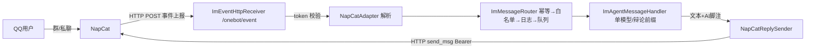

# NapCat QQ 适配器技术预览设计（v1.0，2026-08-30 待确认）

> 背景：C-tier 批次 5 外部依赖中唯一可编码部分。NapCat = 基于 NTQQ 的 Bot 框架，
> 实现 OneBot 11 协议；OmniForge 侧沿用 Phase 3 IM 网关骨架（IMessageAdapter /
> ImMessageRouter / ImWhitelist / ImMessageDedup / ImReplySender / ImAgentMessageHandler），
> **零新依赖**。

## 1. 协议事实（已核实）

- NapCat 支持：HTTP 调用、HTTP POST 事件上报、正向/反向 WebSocket（官方 API 兼容表）
- 出站发送：OneBot 11 HTTP API `send_msg` / `send_group_msg` / `send_private_msg`，Bearer token 鉴权
- 入站事件：`message` 事件（group/private），字段含 `message_id`（幂等键）、`group_id`/`user_id`、`message`（文本或 CQ 码数组）
- 反向 WS 模式：应用为 WS 服务端，NapCat 主动连入（NAT 友好，但 Java 21 无内置 WS 服务端）

## 2. 架构



- `NapCatAdapter implements IMessageAdapter`：解析 OneBot 11 事件（群/私聊），
  签名约定 = `Authorization: Bearer <token>` 常量时间比对（复用钉钉/飞书 Signer 模式）
- `NapCatReplySender implements ImReplySender`：JDK HttpClient 调 NapCat HTTP 端口，
  `send_msg`（带 group_id/user_id 的 message_type 分支），1800 字符截断（与钉钉一致）
- `ImEventHttpReceiver`：SmartLifecycle，`omniforge.im.napcat.event-port`（默认 5120），
  仅 `napcat.enabled=true` 时启动；`POST /onebot/event` 接收上报后进路由。
  GUI/Headless 均可启用（GUI 模式 IM 也能用）；此端点未来可复用于其他平台的 webhook 推送
- 幂等/白名单/落库/虚拟线程队列/AI 脚注：**全部复用既有组件，零改动**

## 3. 模块改动清单

| 文件 | 内容 |
|------|------|
| `omniforge-gateway/src/main/java/com/omniforge/gateway/napcat/NapCatAdapter.java` | 事件解析 + token 校验（约 120 行） |
| `.../napcat/NapCatReplySender.java` | OneBot 11 发送 + 重试/截断（约 100 行） |
| `.../napcat/NapCatProperties.java` | `omniforge.im.napcat.*` 配置绑定 |
| `.../napcat/ImEventHttpReceiver.java` | 事件接收端点（SmartLifecycle） |
| `.../napcat/NapCatAutoConfiguration.java` | 装配（enabled 门控，注册进 AutoConfiguration.imports） |
| 测试 | HttpServer 桩：事件解析/签名校验/回发路径（+6 用例） |

## 4. 配置形态（omniforge.im.napcat.*）

```yaml
omniforge:
  im:
    napcat:
      enabled: false          # 默认禁用
      napcat-host: 127.0.0.1  # NapCat HTTP 服务地址
      napcat-port: 3000
      token: ""               # OneBot 鉴权 token（与 NapCat 配置一致）
      event-port: 5120        # OmniForge 事件接收端口
    whitelist:
      enabled: false          # 复用既有白名单（放行全部）
      entries: []             # 如 qq:123456（QQ 号）/ qqgroup:7890
```

## 5. 触发与回复规则

- 私聊：直接回复
- 群聊：**仅 @机器人 时回复**（NapCat 事件消息含 at 信息）
- 「辩论：」前缀 → 多模型辩论摘要（复用 ImAgentMessageHandler 既有逻辑）
- 回复统一附加 AI 脚注（复用）

## 6. 安全

- token 常量时间比对；无 token 配置时**拒绝接收**（不裸奔）
- 入站全走 ImMessageRouter：白名单 → 幂等去重（message_id）→ 日志 → 异步队列
- 事件端点只绑定回环地址（默认 127.0.0.1，可配 0.0.0.0 供远程 NapCat）

## 7. 真机验证步骤（用户侧）

1. 部署 NapCat（Windows QQ NT）并登录
2. NapCat WebUI 开启 HTTP 服务端 + HTTP 事件上报 → 上报地址 `http://127.0.0.1:5120/onebot/event`，token 一致
3. OmniForge 配置中心开启 NapCat → 私聊/群聊 @ 验证回复

## 8. 待确认决策点（编号回复）

1. **入站通道**：HTTP POST 事件上报为主（与钉钉/飞书/企微 webhook 同构、零新依赖）；
   反向 WebSocket 留作后续增强（需引入 WS 服务端依赖）。确认？
2. **事件接收端点**：新增 `ImEventHttpReceiver`（SmartLifecycle，napcat.enabled 时才启动，
   默认仅回环地址）。此端点同时为未来其他平台 webhook 推送预留。确认？
3. **触发规则**：私聊直接回复；群聊仅 @ 回复；「辩论：」前缀走辩论摘要。确认？
4. **配置形态**：`omniforge.im.napcat.*` Spring 属性（无独立配置文件），白名单复用
   omniforge.im.whitelist。确认？
5. **富文本**：技术预览仅纯文本回复（CQ 码如 at/图片先不支持，收到富文本按文本提取）。确认？
6. **个人微信**：NapCat 不支持微信。个人微信机器人需另选桥接方案（wxBot/wechaty 类，
   需你侧部署确认）；本预览只做 QQ。微信通道待你提供方案后另行设计。确认？
7. **测试与交付**：gateway 模块 napcat 子包 + 6 个单元/集成测试（HTTP 桩）；
   真机验证需你安装 NapCat。确认？
