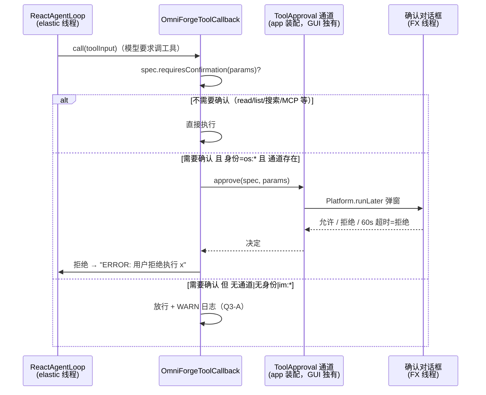

# 工具执行人工确认（HITL）+ current_datetime 工具设计（TOOL_CONFIRMATION_DESIGN）

> 状态：**已确认 · 已交付**（2026-09-11，Q1-Q5 全部采纳推荐项；实施提交 `46d8d9a`，实施偏差见 §六）
> 最后更新：2026-09-11
> **基线：开源仓库 `9ff16f3` / 企业仓库 `ff7b6c8`**（设计依据的代码事实均按此基线逐行核实；实施前若基线前移，由设计窗口重新核对）
> 分工：本设计由设计窗口产出，确认后交开发窗口实施（设计窗口不编码）
> 归属：A 级缺口批次（A1 HITL + A2 时间工具）。
> 代码实证基线（2026-09-11）：`ToolSpec.requiresConfirmation` 已定义（common.spi），当前仅 `ShellExecutorTool` 置 true；回调创建点在 ReactAgentLoop.java:132-133 / 269-270（`OmniForgeToolCallback::new`）；确认标志现仅被 MCP server 目录过滤消费（McpToolCatalog.java:42）；UI 无任何确认流。`current_datetime` 工具不存在于内置工具清单。

---

## 一、决策点（待编号确认）

- **Q1 确认范围（工具级 vs 操作级）**：A=仅按 `ToolSpec.requiresConfirmation` 工具级标志生效（现状仅 shell_executor 会弹确认）；B=shell + file_read_write 的 write/append/delete 操作级确认（read/list 不弹，需给 Tool SPI 加默认方法 `requiresConfirmation(params)`，实现按 operation 判断）**（推荐）**；C=再加 python_interpreter 全量确认。
- **Q2 确认框行为**：A=执行前弹「⚠ 工具待确认」对话框（工具名/参数摘要/允许/拒绝按钮），**60 秒超时视为拒绝**，拒绝后该工具返回 `ERROR: 用户拒绝执行` 给模型，Agent 循环继续但不执行（推荐）；B=超时视为放行。
- **Q3 无确认通道策略**（Headless / IM / 企业服务端 / 无身份请求）：A=自动放行 + WARN 日志（配套：危险工具仍有工具开关+黑名单+白名单三重兜底）（推荐）；B=自动拒绝。
- **Q4 确认身份判定**：A=仅当请求身份为 `os:*`（桌面本地用户操作）且存在确认通道时弹窗；`im:*` 身份与无身份请求一律走 Q3-A 放行兜底（推荐）；B=无视身份，存在确认通道就弹（IM 消息在 GUI 模式下引发弹窗）。
- **Q5 current_datetime 工具形态**：A=零参数（返回 ISO-8601 本地时间 + 时区偏移 + epoch 毫秒）（推荐）；B=支持可选 `timezone` 参数（IANA 名称）。

---

## 二、现状与缺口（代码实证）

1. **标志已备**：`ToolSpec.requiresConfirmation`（common.spi ToolSpec.java:11）注释即为『是否需要在执行前人工确认』；内置四工具仅 `ShellExecutorTool` 为 true（shell/spec 50 行区），PythonTool/FileReadWriteTool/WebSearchTool 均为 false。
2. **消费点缺失**：core.agent 全链路（OmniForgeToolCallback → ReactAgentLoop）不检查该标志；唯一消费方是 MCP server 目录过滤（stdio 无 UI 才排除）。
3. **回调创建点**：ReactAgentLoop 每次 run/stream 用 `request.tools().stream().map(OmniForgeToolCallback::new)` 构建回调——确认钩子需注入到这两处。
4. **UI 弹窗能力现成**：主窗已有 Alert 确认先例（清空数据/删除确认），ThemeManager.attachDialog 可复用暗色主题。
5. **current_datetime 缺失**：内置工具清单（BuiltinToolProvider）无时间工具，Agent 无法获取当前时间锚点。

---

## 三、方案设计

### 3.1 流水时序（Q4-A 口径）

### 3.2 SPI 与回调接线（core/common 层）

| 层 | 改动 | 说明 |
|---|---|---|
| common.spi.Tool | 新增默认方法 `default boolean requiresConfirmation(Map<String,Object> params) { return spec().requiresConfirmation(); }` | 操作级判断接口（Q1-B）；既有实现（含 McpToolAdapter）零影响 |
| common.spi | 新增 `ToolApproval` 接口：`boolean approve(ToolSpec spec, Map<String,Object> params)`；新增 `ToolApprovalDecision` 不必——布尔即可 | 供装配层（app）实现 |
| tools.file.FileReadWriteTool | 覆写 `requiresConfirmation(params)`：operation ∈ {write, append, delete} → true；read/list → false | Q1-B 落地 |
| core.agent.OmniForgeToolCallback | 构造器加可选 `ToolApproval` 与 `boolean interactiveApproval`（身份 os:* 判定），三参/双参兼容构造保留；`call()` 在执行前查 `tool.requiresConfirmation(params)` | 拒绝路径统一 `ERROR: 用户拒绝执行 <工具名>` |
| core.agent.ReactAgentLoop | 构造加可选 `ToolApproval`（AgentAutoConfiguration 经 ObjectProvider 注入，null 零影响）；run/stream 两处回调创建时传入；`interactiveApproval` 取 `request.identityKey()` 前缀判断（null 或 `os:` → true） | identityKey 语义复用 Batch2 |
| core.agent.AgentAutoConfiguration | `ObjectProvider<ToolApproval>` 注入 ReactAgentLoop | Headless/企业（无该 Bean）自动走 Q3-A |

### 3.3 GUI 确认通道（app + ui 层）

- **app 模块**：新增 `com.omniforge.app.safety.AgentSafetyGuiApproval implements ToolApproval`（委托 `com.omniforge.ui.OmniForgeApplication.getApp().confirmToolExecution(...)` 静态入口）+ `AgentSafetyConfiguration`（@Configuration，声明该 Bean）；注册进 OmniForgeLauncher.EmptyConfiguration 的 @Import 列表——**仅 GUI 分支**（HeadlessConfiguration 不 import，Headless 上下文天然无通道）。
- **ui 模块**：新增 `ToolConfirmationDialog`（Alert 风格自绘或 Alert+attachDialog）：工具名、参数摘要（JSON 截断 500 字符）、⚠ 安全提示、[允许] / [拒绝]；线程协议——Agent 弹性线程持 CountDownLatch 等待，FX 线程 showAndWait，ScheduledExecutor 60s 到点对已打开窗口 `close()`（超时计拒绝，Q2-A）；用户点选后 latch 放行。`OmniForgeApplication` 增静态持有 + 入口方法（无窗口/未就绪 → 返回 false 并 WARN，等同拒绝，宁严勿松）。
- **透明性**：步骤卡片在 ToolCallStarted 时若该工具需确认，追加「⏳ 等待用户确认…」状态行（沿用既有 StepCard 事件；确认结果可并入 ToolCallFinished）。

### 3.4 current_datetime 工具（A2）

- 新增 `omniforge-tools/src/main/java/com/omniforge/tools/builtin/CurrentTimeTool implements Tool`：
  - spec：name=`current_datetime`，description 说明『返回当前系统本地时间（ISO-8601）、时区偏移与 epoch 毫秒，用于时间相关推断』，parametersSchema 空对象，requiresConfirmation=false。
  - execute：无参执行（Q5-A），输出如 `{"local":"2026-09-11T14:32:05.123","offset":"+08:00","zone":"Asia/Shanghai","epochMs":1757579525123}`；用 `ZonedDateTime.now()` + `DateTimeFormatter`。
- BuiltinToolProvider 注册表追加 `new CurrentTimeTool()`（零依赖，无需装配改动）。

---

## 四、测试计划

| 用例 | 位置 | 断言 |
|---|---|---|
| Tool 默认方法：不覆写时回退 spec 标志 | common 或 core.spi 测试 | FileReadWriteTool 仅 write/append/delete 返回 true、read/list false；McpToolAdapter 恒等于其 spec 标志 |
| 回调拒绝路径 | OmniForgeToolCallbackTest 增量 | 需确认 + 审批 deny → 返回 `ERROR: 用户拒绝执行`；approve → 正常执行；null 通道 → 执行 + 不抛异常 |
| 身份判定 | ReactAgentLoopTest 增量 | identityKey=os:user 且通道拒绝 → 工具被拒错误流入模型消息；im:qq:x 同通道 → 不查询通道直接执行（mock 通道零调用断言） |
| GUI 通道 | app 层单测 | 无窗口场景 `confirmToolExecution` 返回 false（宁严勿松）；countDown 超时返回 false |
| CurrentTimeTool | tools 新测试类 | 输出 JSON 含 local/offset/epochMs 三键；epoch 与 System.currentTimeMillis 误差 <2s；空参执行不抛异常 |

---

## 五、改动清单（概览）

- common：`Tool.requiresConfirmation(params)` 默认方法、`ToolApproval` 接口（+Javadoc 中文）
- tools：FileReadWriteTool 覆写、CurrentTimeTool 新增、BuiltinToolProvider 注册（+测试）
- core：OmniForgeToolCallback/ReactAgentLoop/AgentAutoConfiguration 接线（+测试）
- app：AgentSafetyConfiguration + AgentSafetyGuiApproval + Launcher @Import（GUI 分支）
- ui：ToolConfirmationDialog + OmniForgeApplication 静态入口/确认持有（无新依赖）
- 文档：本设计文档、REQUIREMENTS/TASKS 同步；全量 `mvn verify` 双仓库

确认后：设计窗口更新本文状态为「已确认」→ **交付开发窗口**按 §三/§四/§五 实施（代码/构建/提交由开发窗口负责，提交信息建议：feat: tool execution confirmation (HITL) + current_datetime tool）。

---

## 六、实施记录（2026-09-11，开发窗口交付，提交 `46d8d9a`，开源 443 用例全绿）

- Q1-Q5 决策全部落实：`Tool.requiresConfirmation(params)` 默认方法、FileReadWriteTool 操作级覆写（write/append/delete 需确认）、CurrentTimeTool 零参数注册、AgentSafetyGuiApproval 仅 GUI @Import（Headless 天然无通道）、ToolConfirmationDialog 60s 超时计拒绝、无窗口入口返回 false（宁严勿松）、步骤卡「⏳ 等待用户确认…」。
- **实施偏差 1（设计修正，后续以本节为准）**：§3.2 原定确认判定放在 `OmniForgeToolCallback.call()`；实施实证发现 ReactAgentLoop 的实际工具执行走循环内 `tool.execute()` 直调（不经过 callback.call()）。因此确认判定**落在 loop run/stream 两处实际执行点**（ReactAgentLoop +102 行），`callback.call()` 内钩子保留为第二条防线（覆盖 SDK 驱动调用路径）。§3.2 表中 `core.agent` 行按此理解。